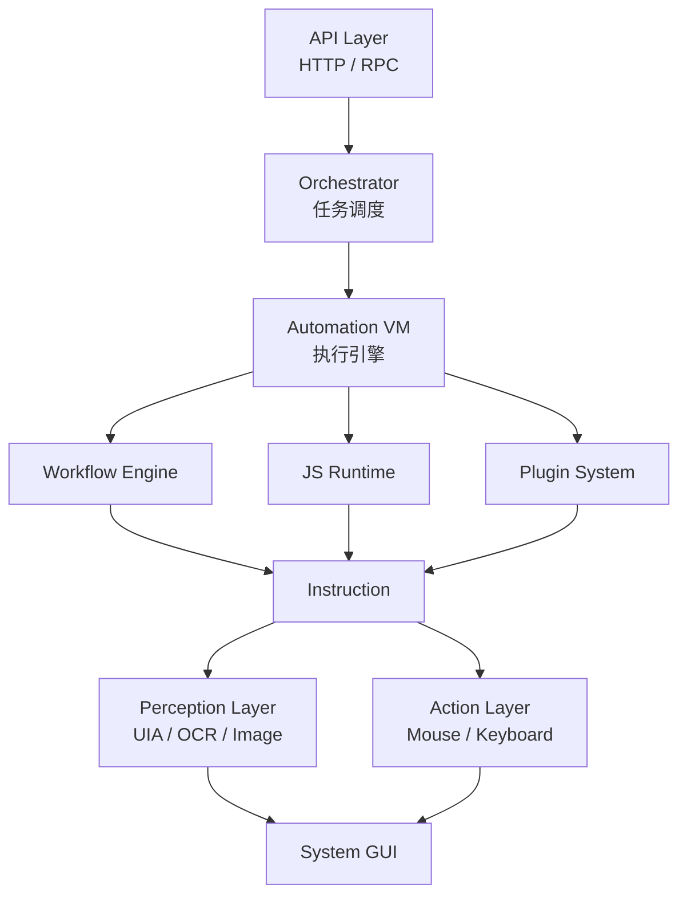
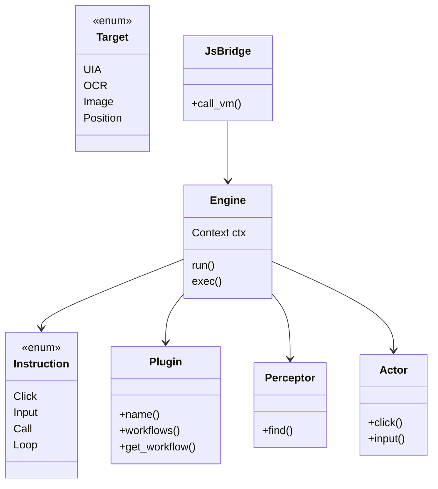
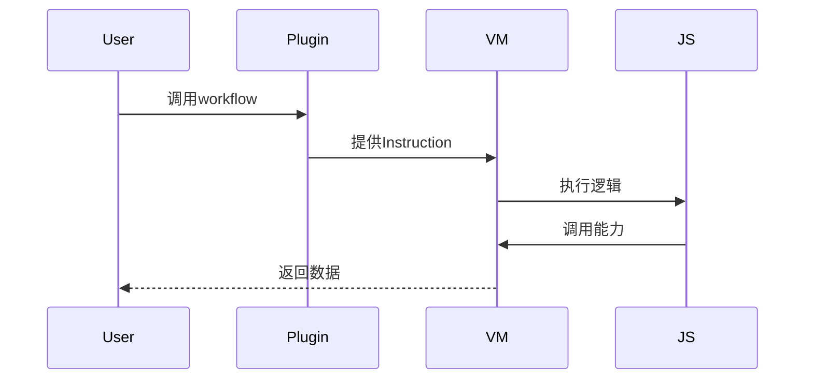
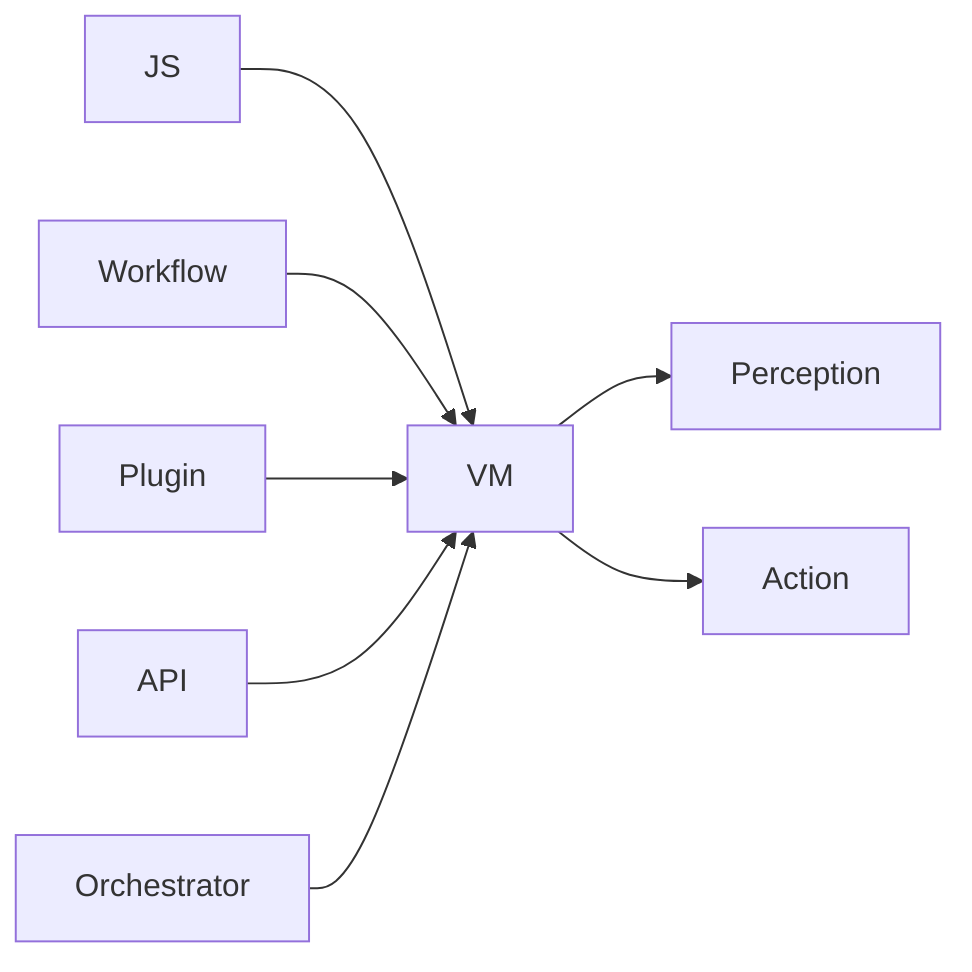

 

---

# 🧠 一、系统架构图（可生成高清）

## ✅ 推荐方式：Mermaid（最简单）

你把下面内容复制到：
👉 [https://mermaid.live](https://mermaid.live)
即可导出 PNG / SVG 高清图

---

## 📊 架构图



---

# 🧱 二、UML 类图（核心结构）

👉 直接复制生成



---

# 🔄 三、核心执行时序图（最重要）

👉 这是你系统的“灵魂流程”

```mermaid
sequenceDiagram

participant Client
participant API
participant Orchestrator
participant VM
participant JS
participant Perceptor
participant Actor

Client->>API: POST /run
API->>Orchestrator: 创建任务
Orchestrator->>VM: run(workflow)

VM->>JS: 执行脚本
JS->>VM: call(click)

VM->>Perceptor: find(target)
Perceptor-->>VM: element

VM->>Actor: click(element)
Actor-->>VM: done

VM-->>Orchestrator: 完成
Orchestrator-->>API: 返回结果
API-->>Client: response
```

---

# 🔁 四、插件执行时序（关键扩展点）



---

# 🧠 五、JS调用桥接时序（重点）

```mermaid
sequenceDiagram

participant JS
participant Bridge
participant VM
participant Actor

JS->>Bridge: await click(el)
Bridge->>VM: exec(Click)
VM->>Actor: click
Actor-->>VM: done
VM-->>Bridge: ok
Bridge-->>JS: Promise resolve
```

---

# 🧭 六、最终你会得到什么结构（总结图）



---

# 🚀 建议你这样用这些图

## 工具推荐

* **draw.io（推荐）**
* Mermaid（轻量）
* PlantUML（更专业）

---

## 用途

| 图   | 用途        |
| --- | --------- |
| 架构图 | 项目介绍 / 汇报 |
| UML | 开发设计      |
| 时序图 | 调试 / 理解执行 |

---
